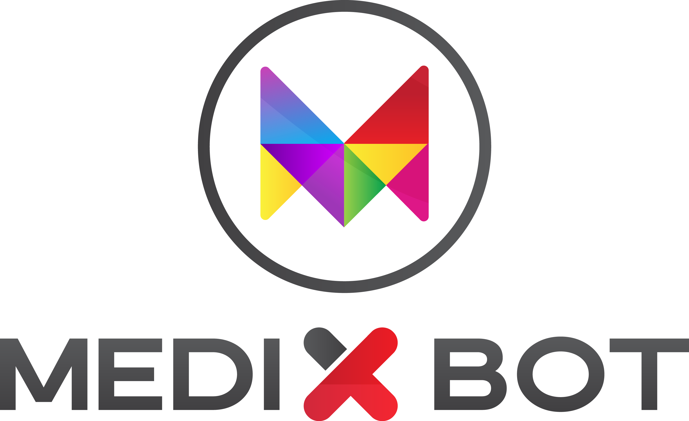

<p align="center"></p>
</br></br>

# Medixbot Physician Copilot

Medixbot Copilot represents an open-source endeavor to equip healthcare professionals with customizable chatbot technology for enhanced decision-making and patient care.

## Abstract
Enabling Physicians to Build Custom Conversational AI Agents/Chabot for Cohesive Understanding of Medical Knowledge to Support Data-Driven Healthcare Decision-Making. Medixbot Copilot aims to provide physicians with the tools necessary to build AI assistants that augment their expertise with data/knowledge-driven medicine, leveraging healthcare knowledge graphs and advanced Natural Language Processing (NLP) techniques.

## Introduction
In the era of smart algorithm-powered interfaces, healthcare is seeing an increasing integration of text or voice-based AI systems and Chatbots. From Google's Duplex to mental health relational agents, the potential for chatbots in medicine spans from patient pathway organization, medication management, to emergency assistance. 

## System Description
Medixbot Copilot utilizes a three-tiered AI-based answering/retrieval system anchored by Large Language Models (LLMs) for NLP and chatbot creation. The system encompasses:
1. Similarity Search on Vector DB: The final layer activates when previous systems can't find an answer, performing a similarity search to find the most related responses from a medical question-answer pair dataset.
2. RAG System: If the knowledge graph falls short, this system retrieves related answers through medical question analysis against RAG data.

## Built with
* Langchain
* Meta Llama
* Pinecone
* Python
* OpenAI
* Streamlit

### 1) LLM Models
Medixbot Copilot supports integration with several LLM systems, including the Open Source LLAMA and OpenAI's models, for nuanced medical query understanding and response generation.

### 2) Similarity Search on Vector DB
The Similarity Search on Vector Database (Vector DB) component of Medixbot Copilot utilizes cutting-edge vector search technologies to identify the most relevant medical information in response to user queries. This process involves transforming complex medical questions and existing knowledge base entries into high-dimensional vectors. By computing the similarity between these vectors, the system can efficiently retrieve the top k most related answers from our extensive medical question-answer pair dataset.

This approach enables the Medixbot Copilot to handle queries that are beyond the scope of structured data available in the knowledge graph or when detailed answers are not readily available through the RAG system. The Vector DB's ability to understand and match based on semantic similarity rather than exact keyword matches allows for more nuanced and contextually relevant responses, significantly enhancing the user experience and the utility of the AI system in practical medical scenarios.

### 3) RAG System
The Retrieval-Augmented Generation (RAG) System stands as a pivotal component in the architecture of Medixbot Copilot, bridging the gap between traditional knowledge graph-based responses and the need for dynamic answer generation. When a query cannot be directly answered using the knowledge graph, the RAG system takes over by leveraging a vast database of medical information to find the most relevant documents or data snippets related to the query.

Utilizing a two-step process of retrieval followed by answer generation, the RAG system first identifies relevant information from a corpus of medical data. It then uses this information to generate coherent, accurate responses. This mechanism allows Medixbot Copilot to provide informed responses even to complex medical questions, by drawing upon a broad range of sources and generating answers that are both contextually relevant and informed by authoritative medical content.

Together, the Similarity Search on Vector DB and the RAG System enhance Medixbot Copilot's capabilities, ensuring that it can provide high-quality, informative responses across a wide spectrum of medical queries, making it a powerful tool for healthcare professionals and patients alike.

## Datasets

* We used the following sample documents from the following sources(We highly advice you to replace those with your resources and documents related to your domain of expert);
  * UMNwriteup.pdf: Sample Written History and Physical Examination
  
* We also used the following question banks from the following sources(gathered on 2017);
  * [eHealth Dataset](http://ehealthforum.com/health/health_forums.html)
  * [iCliniq Dataset](https://www.icliniq.com/qa/medical-conditions)
  * [Question Doctors Dataset](https://questiondoctors.com/blog/page/1)
  * [WebMD Dataset](http://answers.webmd.com/explore-answerers?alpha=a&pagenumber=1)

Note: We downloaded the four question banks as offline Json files and store into the data folder

## UI/UX and Web Interface
Medixbot Copilot's interface, built with Streamlit Chat, is easily customizable to fit varying healthcare professional needs, allowing for intuitive interaction with the AI system.

## Getting started
This will help you understand how you may give instructions on setting up your project locally. To get a local copy up and running follow these simple example steps.

### Installation
Instructions to set up the environment, clone the repository, and install dependencies.

Follow these steps to install and set up the project directly from the GitHub repository:
1) **Clone the Repository**
   - Open your terminal or command prompt.
   - Navigate to the directory where you want to install the project.
   - Run the following command to clone the GitHub repository:
   ```
   git clone repot.git
   ```

2) **Create .env file**
   - Navigate to the main folder and create a `.env` file with the following default architecture:
   ```
   INDEX_NAME="medixbot"
   PINECONE_API_KEY="your Pinecone API key"
   PINECONE_API_ENV="gcp-starter"
   LLAMA_MODEL_URL="https://huggingface.co/TheBloke/Llama-2-7B-Chat-GGML/blob/main/llama-2-7b-chat.ggmlv3.q4_0.bin"
   LLAMA_MODEL_DIR="model/llama-2-7b-chat.ggmlv3.q4_0.bin"
   DATA_PATH="data"
   USE_OPENAI=False #set it to True if you want to use LLAMA instead
   OPENAI_MODEL="gpt-3.5-turbo"
   OPENAI_MAX_TOKENS=1000
   OPENAI_API_KEY=""
   TEMPERATURE=1.2
   ```

Note: You can rename the example.env to .env and set you keys

3) **Install required libraries**
   - From the command line, run `pip install -r requirements.txt` to install all required packages.

4) **Choose your AI agent: LLama or OpenAI**
   - Common steps for both systems:
      - Go to the Pinecone official website and create an account.
      - After that, create a Pinecone index with dimension = 384 or the dimension supported by the model if you want to use a different model than the one used in this project.
      - Get a Pinecone API key and environment key and update your `.env` file.
   - For OpenAI, get your OpenAI key and update the `.env` file and set `USE_OPENAI=True`.
   - For LLama, you can use the default LLama model used in this project which you can download from `https://huggingface.co/TheBloke/Llama-2-7B-Chat-GGML/blob/main/llama-2-7b-chat.ggmlv3.q4_0.bin` make sur it is inside `model` folder or go to `https://huggingface.co/TheBloke/Llama-2-7B-Chat-GGML/tree/main` and download the model you want, but be careful about the dimension supported by the model.

5) **Add your documents into data/ folder**
   - Add the PDF type documents you want to query into the `data` folder.

6) **Run setup.py**
   - From the command line, run `python setup.py` to populate your Pinecone database with the vector form of your documents.

7) **Run chat.py**
   - From the command line, run `streamlit run chat.py` to launch your application, which will open in the default browser of your computer.
   - You are now ready to ask any related questions which have their responses inside the documents you previously downloaded.

8) **Note**
Use the OpenAI if your want low latency. But if you care more about cost, then use LLama model

## Disclaimer
This software is provided for informational and educational purposes only. Despite our best efforts to provide useful and accurate information, errors may appear from time to time. The information provided by Medixbot Copilot is not intended to be a substitute for professional medical advice, diagnosis, or treatment. Always seek the advice of your physician or another qualified health provider with any questions you may have regarding a medical condition. Never disregard professional medical advice or delay in seeking it because of something you have read on or through this software.

The accuracy of the data and models used in this project are based on current medical knowledge and artificial intelligence technologies. However, Medixbot and its contributors do not guarantee the accuracy of the information provided by the system and are not responsible for any errors or omissions, or for results obtained from the use of this information.

All information in the project is provided "as is", with no guarantee of completeness, accuracy, timeliness or of the results obtained from the use of this information, and without warranty of any kind, express or implied.

## License
This project is made available under the MIT License. For more details, see the <a href="./LICENSE.txt">LICENSE.txt</a> file in this repository.

## Acknowledgement
This project was supported by; Ali Lazim / Laural Consulting LLC (USA), Medixbot, Prof. Dr. Mustafa Zahit Yildiz, and Prof. Dr. Mustafa Can from the Biomedical Technologies Application and Research Center (BİYOTAM), in partnership with SAKARYA UNIVERSITY OF APPLIED SCIENCES.

## References
A curated list of references that inspired and supported the development of Medixbot Copilot, including links to medical datasets, research papers, and related healthcare AI innovations;
* https://medicalfuturist.com/top-10-health-chatbots/
* https://www.medicinenet.com/medterms-medical-dictionary/article.htm
* https://www.bbc.com/news/technology-36528253

## Medixbot Website
Visit us at Medixbot Website for more information and updates.


